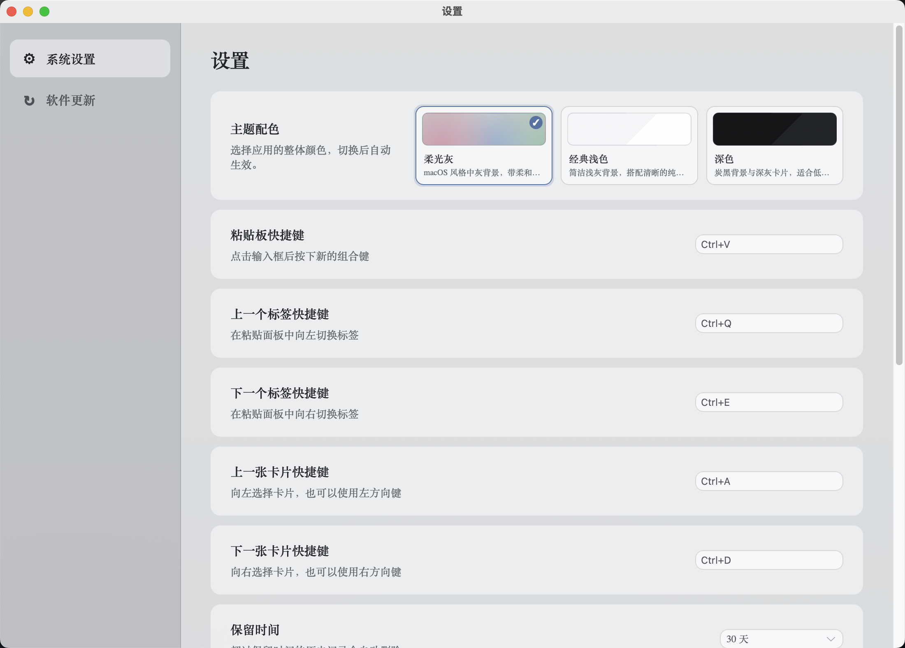
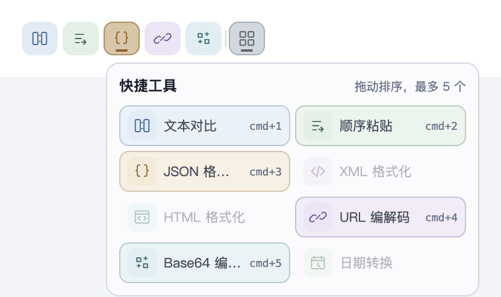
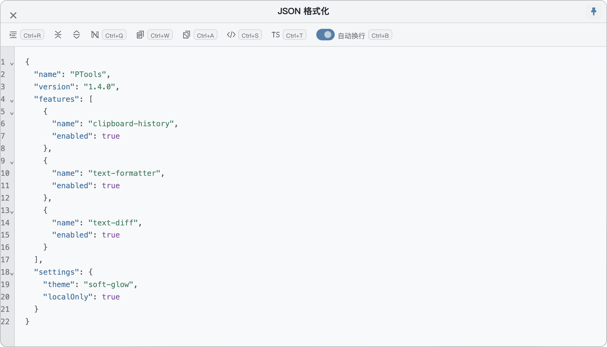
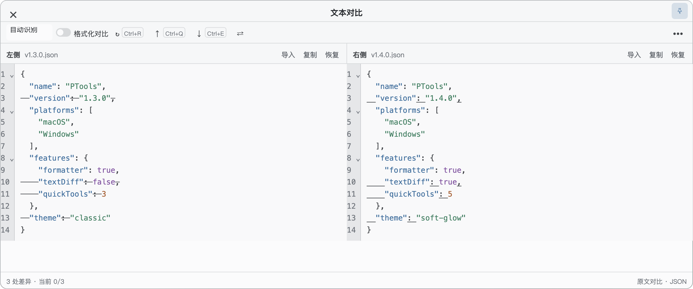

  

<h1 align="center">PTools</h1>

A local-first cross-platform clipboard history app

  <a href="README.md">简体中文</a> | <a href="README_EN.md">English</a>

  <a href="#screenshots">Screenshots</a> · <a href="#download-and-install">Download</a> · <a href="#highlights">Features</a> · <a href="#quick-tools">Quick Tools</a> · <a href="#formatting-tools">Formatting Tools</a> · <a href="#text-comparison">Text Comparison</a> · <a href="#sequential-paste">Sequential Paste</a> · <a href="#todo">TODO</a> · <a href="#how-to-use">How to Use</a> · <a href="CHANGELOG.md">Changelog</a> · <a href="#privacy-and-permissions">Privacy</a> · <a href="#license">License</a>

PTools is a local-first, cross-platform clipboard toolkit that brings history, search, tags, formatting, and text comparison into the copy-and-paste workflow. Clipboard data and tool processing stay on your device and are never uploaded.

> The latest stable release is `v1.4.1`. See the [Changelog](CHANGELOG.md) for the full release history.

## Screenshots

### Clipboard Panel

### Settings

## Download and Install

1. Download the matching installer from [Releases](https://github.com/white-super/PTools/releases):
   - `aarch64` for Apple Silicon Macs.
   - `x86_64` for Intel Macs.
   - Windows users should download the `x64-setup.exe` installer.
2. On macOS, open the `.dmg` and drag **PTools** into Applications. On Windows, run the `.exe` installer and follow the prompts.
3. Press `Ctrl + V` on macOS or `Alt + V` on Windows to open the clipboard panel.

> If macOS blocks the first launch, allow the app in **System Settings → Privacy & Security**. Windows may show a SmartScreen prompt for an unsigned installer; choose **More info → Run anyway** if you trust the download.

## Highlights

- **Local history** for copied text, images, and files, with full-history search and type or tag filters.
- **Fast restore and paste** with double-click, Enter, or number keys, plus optional automatic paste back into the previous app.
- **Configurable quick tools** with up to five slots, drag-and-drop ordering, and editable shortcuts.
- **Formatting and conversion** for JSON/JSONC, XML, HTML, URL, Base64, and date content in independent windows.
- **Text comparison** for clipboard text and local UTF-8 text files, including formatted JSON, XML, and HTML comparison.
- **Sequential paste** for temporarily collecting, ordering, and pasting text, images, or files one item at a time.
- **Flexible settings** for themes, shortcuts, content types, retention duration, and record limits. Tagged entries are kept outside automatic history cleanup.

## Quick Tools

A lightweight quick-tool bar sits at the top center of the clipboard panel. By default it contains Text Comparison, Sequential Paste, JSON Formatter, URL Encode/Decode, and Base64 Encode/Decode.

1. Open the grid button to choose up to five tools from Text Comparison, Sequential Paste, JSON, XML, HTML, URL, Base64, and Date.
2. Drag tools to reorder them. Click a selected tool in the manager to remove it. The configuration is stored locally.
3. `cmd+1` through `cmd+5` open the tool in the corresponding position by default. When used in the clipboard panel, formatter shortcuts import the selected text card. Shortcuts follow new positions after reordering and can be edited individually in Settings.
4. Hover a tool to immediately see its name and current shortcut. Tools with an open window show an active state.
5. Clicking a formatter icon opens an empty workspace without importing clipboard content. Text Comparison opens an empty, pinned comparison window; Sequential Paste opens a temporary queue on the right side of the screen.
6. Right-click a text card and open “Use Tool” to access every text tool, regardless of which tools are in the quick bar.

## Formatting Tools

1. Select a text entry in the clipboard panel.
2. Press `F` to open an independent formatting workspace. Escaped JSON text is also recognized.
3. Clicking a tool in the quick bar opens an empty workspace. Using its shortcut on a card, or right-clicking a text card and opening “Use Tool,” imports that card's content.
4. JSON supports formatting, folding, comment removal, minified or escaped copies, and XML/TypeScript conversion. URL, Base64, and date entries expose their corresponding conversion actions.
5. All formatting tools support shortcuts: use `Ctrl + R` for regular formatting; JSON comment removal, minifying, escaping, and conversions use `Ctrl + Q/W/A/S/T`; URL, Base64, and date conversions use `Ctrl + E/D`.
6. The toolbar includes an auto-wrap toggle enabled by default; press `Ctrl + B` to switch it quickly. When text is selected, formatting and encoding/decoding apply only to the selection; otherwise they apply to the full content.
7. The editor search panel opens at the top with localized controls. Press `Esc` once to close search, then press it again to close the formatter window.
8. Press `Command + D` or `Alt + D` to pin or unpin the window. Pinned windows stay visible when unfocused, and multiple formatter windows can be open at the same time.

## Text Comparison

1. Select a text or text-file card and press `D` to mark the left source. Select another card and press `D` to open a side-by-side comparison. The context menu provides the same actions.
2. The left source shows `Diff-L`, while the currently selected right candidate shows `DIFF-R`. Both markers sit near the right side of the fixed-height card header without resizing the card. Press `D` again or click a marker to clear it; closing the clipboard panel clears all markers. Multi-file cards prompt you to select one file.
3. Click Text Comparison in the quick-tool bar (default shortcut: `cmd+1`) to open a comparison with both sides empty for manual pasting. Windows opened from this entry are pinned by default.
4. Raw comparison is the default. Enable formatted comparison for JSON/JSONC, XML, or HTML, with automatic or manual type selection and support for escaped JSON. XML/HTML retain meaningful whitespace; formatted equality does not imply byte-identical source files.
5. Includes inline highlights, synchronized scrolling, difference navigation, swapping sides, line wrapping, and collapsing unchanged regions. Use `Ctrl + Q/E` for previous/next difference, `Ctrl + R` to recompute, and `Ctrl + B` to toggle line wrapping.
6. Edit either side directly with live difference highlighting and undo/redo. Typing does not reformat your text; press `Ctrl + R` to reformat when formatted comparison is enabled. Each side supports importing UTF-8 text files (including UTF-8 BOM), restoring the source, and copying displayed content. Images, binary files, and directories are unsupported. Edits affect temporary copies only; files and history entries are never overwritten automatically.
7. Multiple independent windows follow the app theme and remain open when unfocused. Use `Command + D` / `Alt + D` to toggle always-on-top. Press `Esc` to close an unpinned window; pinned windows ignore `Esc`. The global clipboard shortcut remains available. Closing an edited draft requires confirmation.
8. Full formatting and comparison run in a cancellable background worker on your device. Direct edits use local incremental comparison to preserve the caret and undo history. Content is not uploaded.

## Sequential Paste

  

1. Open Sequential Paste from the quick-tool bar to keep a compact, independent queue on the right side of the screen. The entry does not import the selected card or existing history.
2. Capture mode automatically appends subsequently copied text, images, and files. Duplicates are allowed, and items can be reordered, removed, or cleared.
3. Switch to Paste mode and choose forward or reverse order. `Ctrl + Shift + V` pastes the next item by default, and the shortcut is editable in Settings.
4. An item leaves the queue only after a successful paste. The next item is highlighted while the window stays visible; failures remain in place with a contextual error. The global shortcut is released when the queue is complete.
5. The queue is session-only. Closing its window or quitting PTools clears it without creating a persistent queue table.

## TODO

- [ ] **Password manager**: Generate random passwords and store them encrypted in the local database.
- [x] **Extended formatting**: Support XML, HTML, URL encode/decode, date formatting and conversion, and Base64 encoding/decoding.
- [x] **Text comparison**: Select text or file cards with two presses of `D`, with side-by-side differences and formatted JSON/XML/HTML comparison.
- [x] **Sequential paste**: Temporarily collect multiple clipboard items, reorder them, and paste forward or backward with a configurable shortcut.
- [ ] **cURL request tool**: Parse cURL text in a dedicated request workspace and inspect responses.
- [ ] **Image crop tool**: Crop, resize, copy, or save clipboard images.

Checked items shipped in `v1.4.0`; unchecked items remain planned for future releases.

## How to Use

1. Copy text, an image, or files; PTools records enabled types locally.
2. Press `Ctrl + V` on macOS or `Alt + V` on Windows to open the panel. You can change this shortcut in Settings.
3. Find an entry with search, content-type filters, or tags, then select it. On macOS, press `Command + F` to focus search.
4. Double-click, press Enter, or press `1`–`5` to restore it.
5. Use `F`, `D`, the quick-tool bar, or the card context menu to process the selected content. Open Sequential Paste for repeated data entry.
6. With **Auto paste after double-click** enabled, PTools pastes into your previous app; otherwise it only restores the clipboard.

## Settings

- **Clipboard shortcut**: Set the global shortcut for opening the panel.
- **Retention and record limit**: Control how long local history is kept.
- **Content types**: Enable or disable text, image, and file history separately.
- **Accessibility permission**: View its status and open macOS System Settings when needed.
- **Software updates**: Check for updates or open the GitHub download page.

## Privacy and Permissions

PTools does not upload clipboard history. Clipboard items and settings stay on your device. You can shorten retention, disable a content type, or clear all history at any time. See the [Privacy Policy](PRIVACY.md) for details.

On macOS, allow **PTools** in **System Settings → Privacy & Security → Accessibility** to use global shortcuts and auto-paste. Windows does not require macOS Accessibility permission. This permission is only used to handle shortcuts and send paste actions after you explicitly choose an item.

## Feedback and Contributing

Report bugs or share ideas through [Issues](https://github.com/white-super/PTools/issues). See [CONTRIBUTING.md](CONTRIBUTING.md) to contribute code.

## License

PTools is open source under the [Apache License 2.0](LICENSE).
